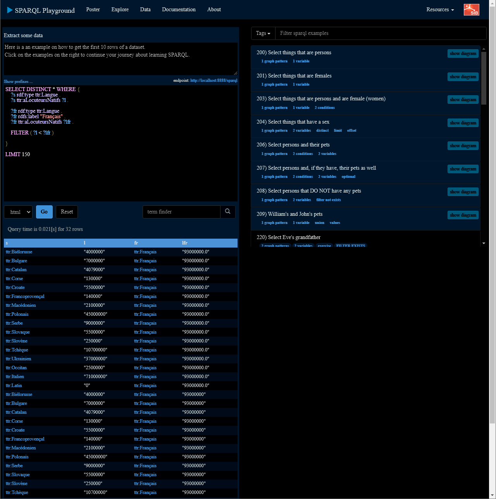
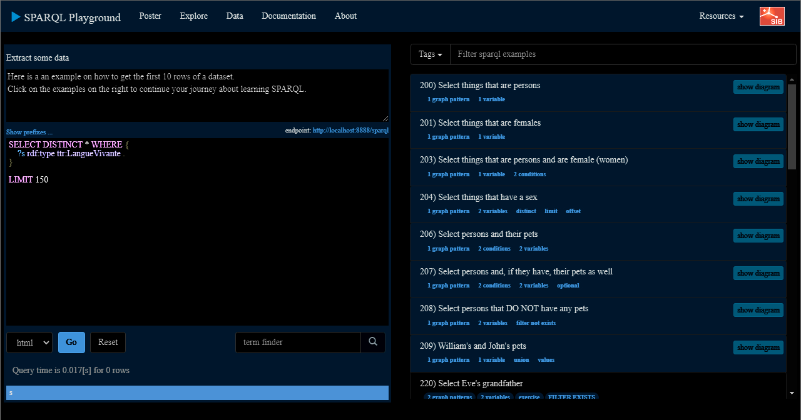
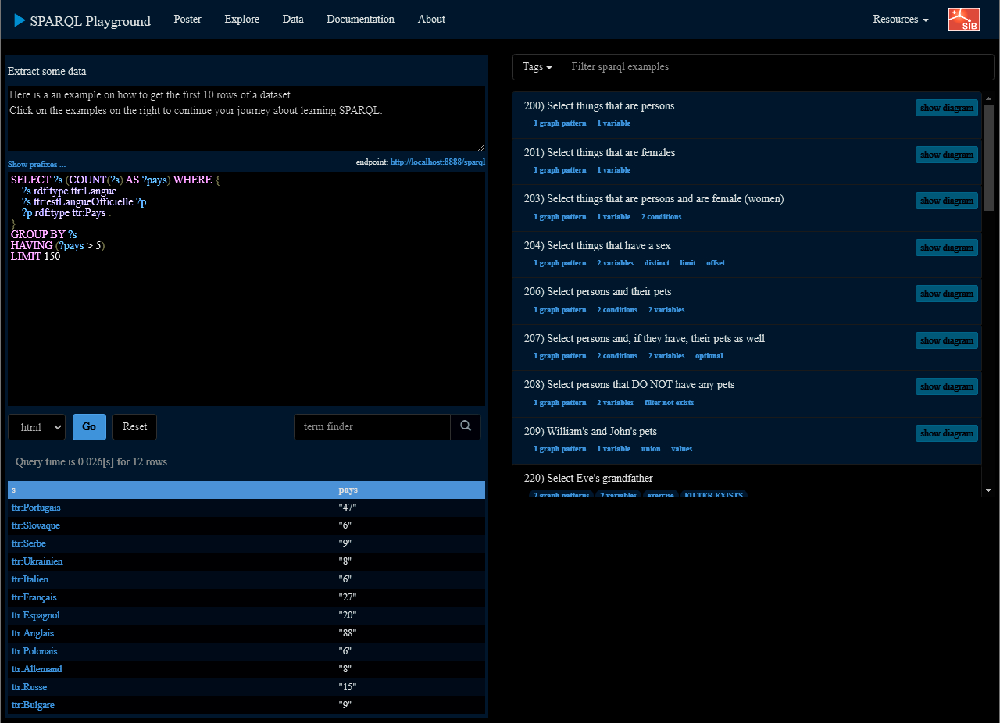
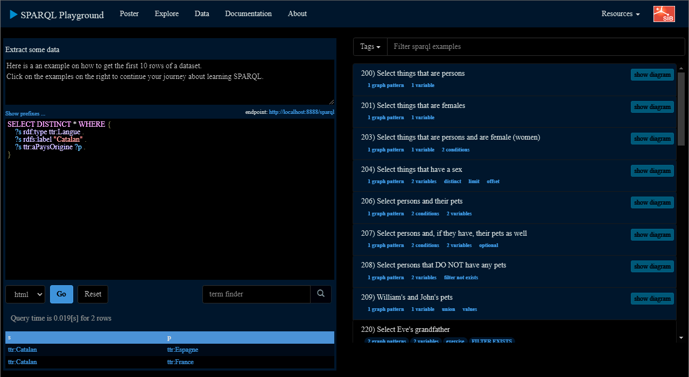
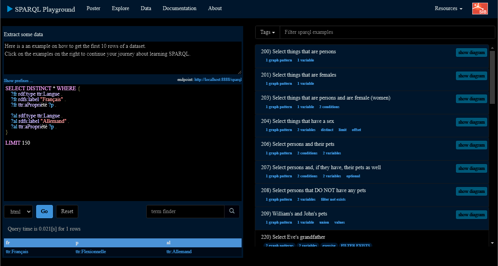

# 1. Quelles sont les langues qui ont un nombre de locuteurs natifs supérieur à 10 millions?

```sparql
SELECT DISTINCT * WHERE {
  ?s rdf:type ttr:Langue .
  ?s ttr:aLocuteursNatifs ?l .
  FILTER ( ?l > 100000000 )
}

LIMIT 150
```

# 2. Quelles sont les langues qui ont moins de locuteurs que le français?
```sparql
SELECT DISTINCT * WHERE {
    ?s rdf:type ttr:Langue .
    ?s ttr:aLocuteursNatifs ?l .

    ?fr rdf:type ttr:Langue .
    ?fr rdfs:label "Français" .
    ?fr ttr:aLocuteursNatifs ?lfr .

    FILTER ( ?l < ?lfr )
}

LIMIT 150
```


# 3. De quelles langues le français est-il adstrat?
```sparql
SELECT DISTINCT * WHERE {
    ?fr rdf:type ttr:Langue .
    ?fr rdfs:label "Français" .
    ?fr ttr:estAdstrat ?s .
}

LIMIT 150
```


# 4. Quelles sont les langues qui sont des langues vivantes?
```sparql
SELECT DISTINCT * WHERE {
    ?s rdf:type ttr:Langue_vivante .
}

LIMIT 150
```
### Pas de résultats car la classe LangueVivante n'est pas utilisée dans le fichier ttl, mais par le raisonnement de la classe, on pourrait faire une requête supplémentaire avec le nombre de locuteurs natifs


# 5. Quelles sont les langues qui sont utilisées dans plus de 5 pays?
```sparql
SELECT ?s (COUNT(?s) AS ?pays) WHERE {
    ?s rdf:type ttr:Langue .
    ?s ttr:estLangue ?p .
    ?p rdf:type ttr:Pays .
}
GROUP BY ?s
HAVING (?pays > 5)
LIMIT 150
```

# 6. Quelles sont les langues parlées en europe ?
```sparql
SELECT DISTINCT * WHERE {
    ?s rdf:type ttr:Langue .
    ?s ttr:estLangue ?p .
    ?p rdf:type ttr:Pays .
    ?p ttr:aRégion ?r .
    ?r ttr:aContinent ttr:Europe .
}

ORDER BY ?s
LIMIT 150
```

# 7. Combien de langues sont de type SVO, et combien sont de type SOV?
```sparql
SELECT DISTINCT * WHERE {
    ?s rdf:type ttr:Langue .
    ?s ttr:aPropriété ?p .

    ?p rdfs:label ?type .
    FILTER ( ?type = "SVO" || ?type = "SOV" )
}

LIMIT 150
```

# 8. Combien de locuteurs maternels a le français?
```sparql
SELECT DISTINCT * WHERE {
    ?s rdf:type ttr:Langue .
    ?s rdfs:label "Français" .
    ?s ttr:aLocuteursNatifs ?l .
}

LIMIT 150
```

# 9. Quels sont les pays d'origine du catalan?
```sparql
SELECT DISTINCT * WHERE {
    ?s rdf:type ttr:Langue .
    ?s rdfs:label "Catalan" .
    ?s ttr:aPaysOrigine ?p .
}
```

# 10. Quelles sont les propriétés communes entre le français et l'allemand?
```sparql
SELECT DISTINCT * WHERE {
    ?fr rdf:type ttr:Langue .
    ?fr rdfs:label "Français" .
    ?fr ttr:aPropriété ?p .

    ?al rdf:type ttr:Langue .
    ?al rdfs:label "Allemand" .
    ?al ttr:aPropriété ?p .
}

LIMIT 150
```



